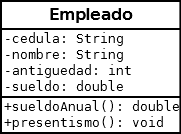

## PRACTICO 2
### Crear dos paquetes: *logica* y *consola* 
### 1) a) Desarrollar la clase **Electrodomestico** ( en el paquete logica) con las siguientes características:

- Atributos: nombre (String), marca (String) y consumo (double)
- constructores: Por defecto y Específico
- getters & setters
- toString

### b) Desarrollar  la clase **PrincipalElectro** (en el paquete consola):

- Crear dos Electrodomésticos e1 y e2 con el constructor por defecto
- Los datos de e1 cargarlos usando los setter (asignando usted los datos).
- Los datos de de e2 cargarlos usando los setter pero desde el teclado.
- Mostrar en pantalla el nombre de e1.
- Mostrar en pantalla, todos los datos de e2 usando un solo método.

### 2) a) Desarrollar la clase **Auto** (en el paquete logica) con las siguientes características:

- Atributos: marca (String), velMax (double), potencia (int) y precio (double)
- constructores: Por defecto y Específico
- getters & setters
- toString

### b) Desarrollar  la clase **PrincipalAuto** ( en el paquete consola): 
- Crear dos Autos  a1 y a2 con el constructor por defecto
- Los datos de a1 cargarlos usando los setter (asignando usted los datos).
- Los datos de de a2 cargarlos usando los setter pero desde el teclado.
- Mostrar en pantalla el precio de a1.
- Mostrar en pantalla, todos los datos de a2 usando un solo método.

### 3) a) Desarrollar la clase **Empleado** (en el paquete logica) con las siguientes características:

- Atributos: cedula (String), nombre (String), antiguedad (int) y sueldo (double)
- constructores: Por defecto y Específico
- getters & setters
- toString

### b) En la clase **PrincipalEmpleado** ( en el paquete consola):

- Crear el Empleado e1 con el constructor específico, Los datos de e1 son: cedula: 1111, nombre: Pedro, antiguedad: 4 sueldo: 25000

- Crear el Empleado e2 con el constructor por defecto.

- Cargue los datos de e2 desde el teclado (invente usted los datos)

- Muestre los datos de los dos empleados  

## Enviar los link de sus github para corregir
## NO ENVIAR CAPTURAS DE PANTALLA NI archivos RAR ni ZIP

..........................................

## PRACTICO 2B

### 1) Utilizando la clase Electrodomestico del practico 2 

y teniendo en cuenta el Diagrama de Clase.

   

 Se pide agregar a la clase **Electrodomestico** el atributo costo y el método específico respetando el diagrama, es decir, NO pueden agregar cosas que no vea en el diagrama.

Los métodos hacen lo siguiente:

• **public double precioVenta():** El método devuelve el valor de costo con un incremento del 20% (o sea la operación a realizar es: costo*1.20).

• **public  String  toString():** Devuelve transformado en String: nombre marca, costo y precioVenta() del electrodomestico.     (ESTE HAY QUE MODIFICARLO!)

 

En la clase **PrincipalElectrodomestico** deberá crear dos objetos de tipo Electrodomestico, uno con todos los valores cargados con el constructor específico, otro con los métodos setters. Puede cargar los atributos con valores constantes, tal como se realizó en el teórico.

### 2) Utilizando la clase Empleado del practico 2 

y teniendo en cuenta el Diagrama de Clase.

   

Incluir todo lo solicitado en los ejercicios anteriores.

Los métodos hacen lo siguiente:

•       **public double sueldoAnual():** El método devuelve el salario anual percibido

•       **public void presentismo():** El método incrementa el valor de salario en un 10%.

•       **public  String  toString():** Devuelve transformado en String: los atributos y salarioAnual() (ESTE HAY QUE MODIFICARLO!)

En  la clase **Principal** (que se encuentra en el paquete consola): 

1) Crear el Empleado e1 con el constructor específico, 
Los datos de e1 son: 
  cedula: 1111,
  nombre: Pedro,
  antiguedad: 4
  sueldo: 25000

2) Crear el Empleado e2 con el constructor por defecto.

3) Cargue los datos de e2 desde el teclado (invente usted los datos)

4) Muestre los datos de los dos empleados

### 3) Desarrollar la clase Carta, teniendo en cuenta el siguiente diagrama de clase:
   

y con los siguientes requerimientos:

El constructor por defecto debe inicializar al atributo numero en 1 y al palo en basto”.
El constructor específico debe controlar que los valores recibidos son correctos:

• Atributo **número** : Valores entre 1 y 12.

• Atributo **palo** : “basto”, “copa”, “espada” u “oro”.

Además se pide:

• **public void  siguienteCarta():** Modifica el valor del objeto de tipo Carta por la siguiente, utilizando un orden alfabético para los palos. Por ejemplo la siguiente carta al 12 de espada es el 1 de oro.

• **public String toString():** Ejemplo de devolución: “1 de basto”

En la clase **Principal** debe imprimir, utilizando un for, las 48 cartas.

## Enviar los link de sus github para corregir
## NO ENVIAR CAPTURAS DE PANTALLA NI archivos RAR ni ZIP

